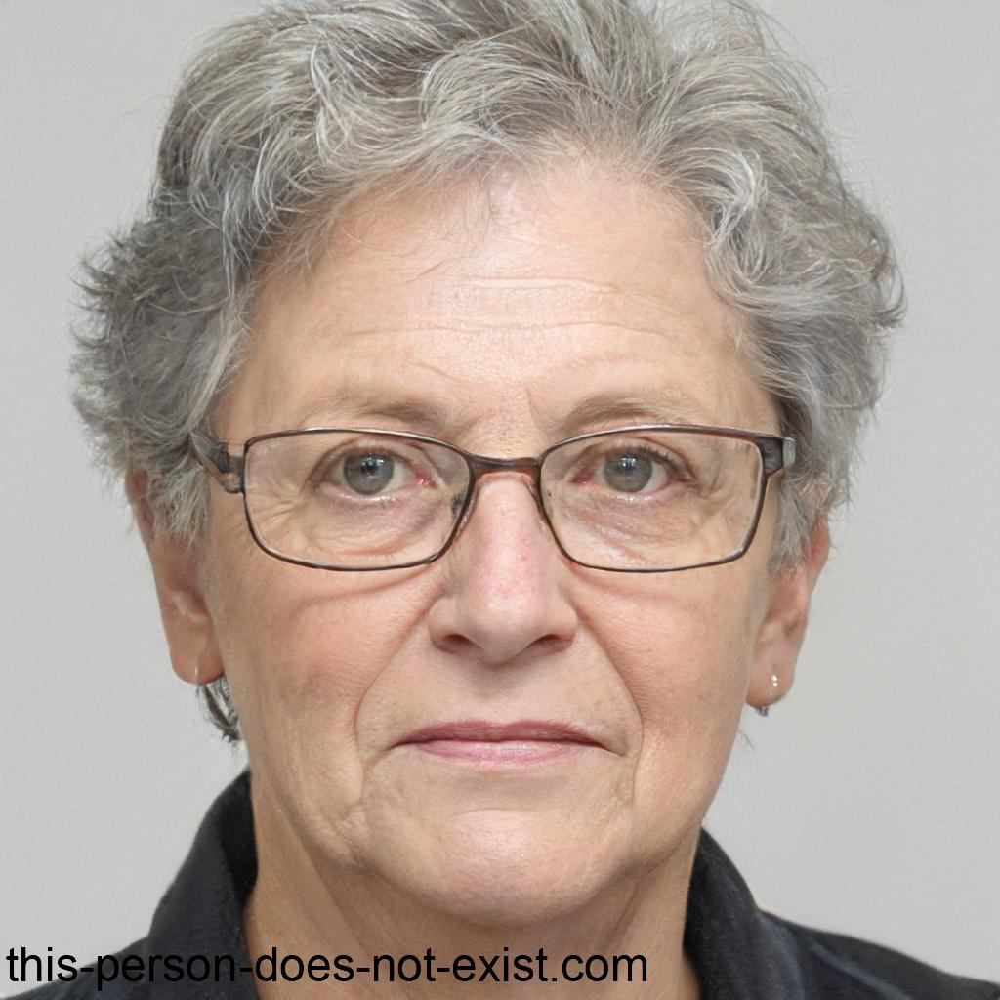
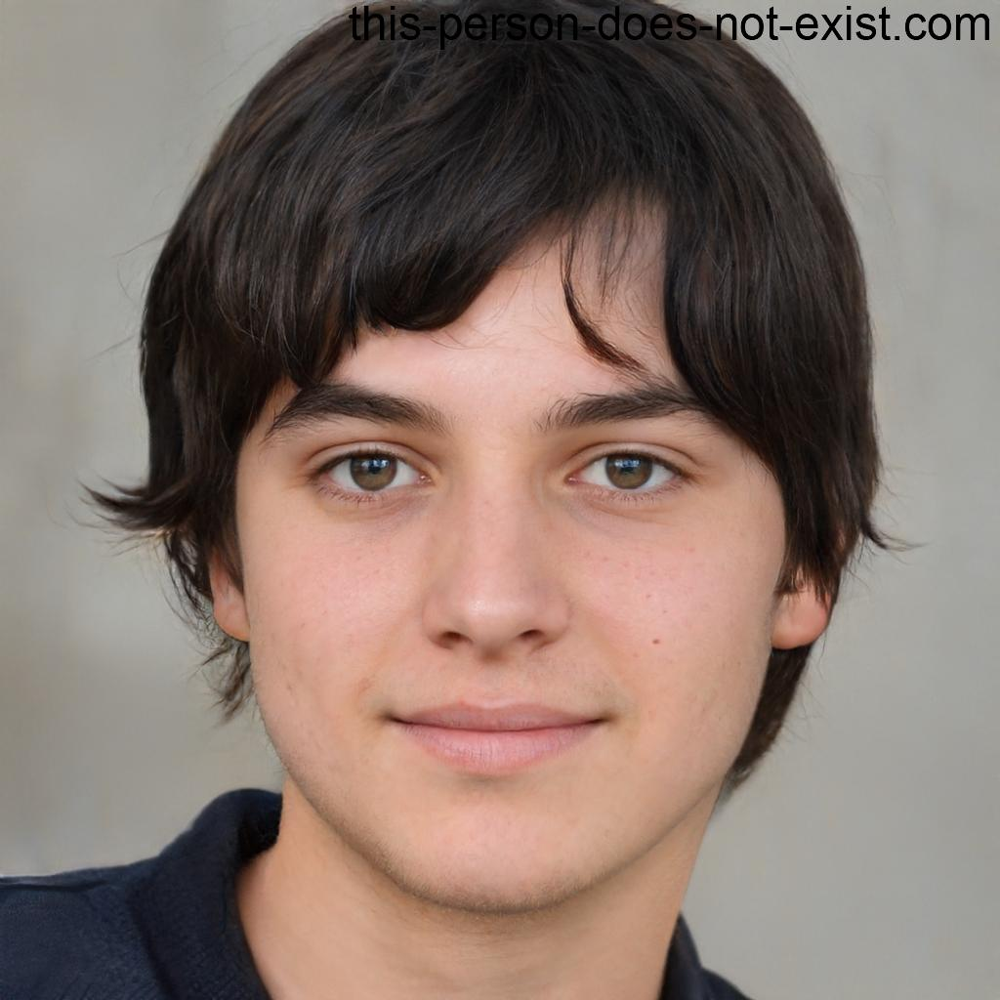
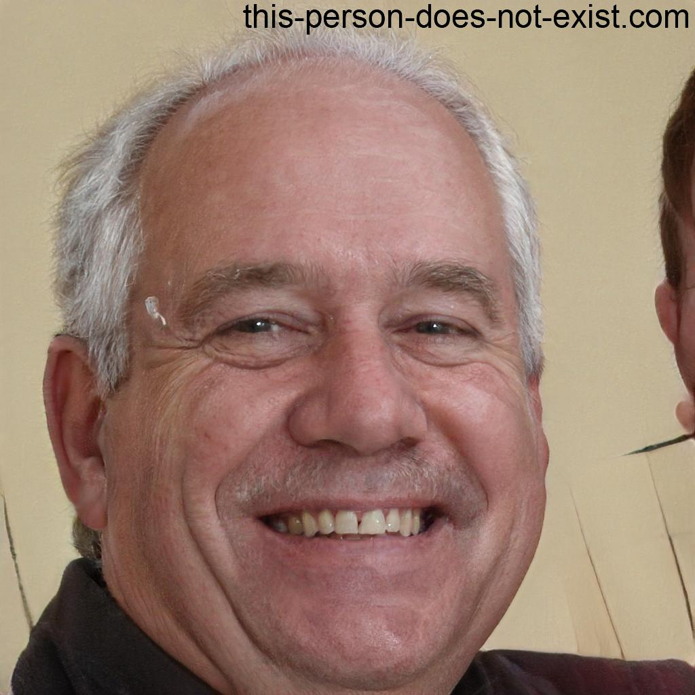
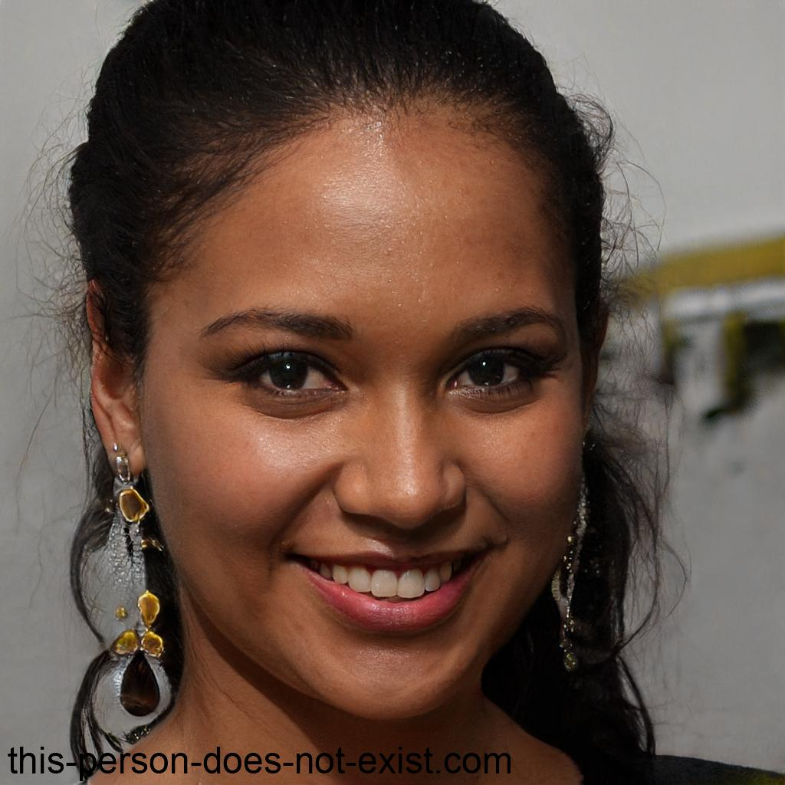

# Especificações do Projeto

## Personas

|**Antonia Marques**|           |                             | 
|-------------------|-----------|-----------------------------|
|**Idade:** 75 anos. **Naturalidade:** Poços de Caldas - Minas Gerais. **Ocupação:** Aposentada.       |**Atribuições:** Dona de casa. 
|**Motivações:** Manter-se atualizada sobre os acontecimentos do mundo. Ela usa a internet para se manter informada sobre política, saúde, cultura e outros temas relevantes, e também para compartilhar informações com seus amigos e familiares  |**Frustações:** Dificuldade em discernir notícias falsas de verdadeiras, e devido a isso, teve sua confiança abalada nos veículos de mídia. Além disso, ela percebe que alguns indivíduos usam notícias falsas para manipular outras pessoas, sem se importar com as consequências negativas para a sociedade.   |**Hobbies, história:**  Espera conseguir diferenciar as notícias falsas e voltar a utilizar a internet para compartilhar informações sem medo, e poder também, conscientizar e ajudar outras pessoas.

|**Pedro Oliveira**|           |                             | 
|-------------------|-----------|-----------------------------|
|**Idade:** 17 anos. **Naturalidade:** Petrópolis, Rio de Janeiro. **Ocupação:** Estudante.       |**Atribuições:** Estudante do ensino médio.
|**Motivações:**  Terminar o ensino médio com boas notas e garantir sua entrada em uma universidade. Tem interesse em tecnologia e videogames, passando bastante tempo jogando e assistindo a vídeos relacionados a esse tema no YouTube. Além disso, Pedro gosta de passar tempo com sua família e amigos, e está sempre em busca de novas experiências e aventuras. |**Frustações:** Pressão dos estudos e as expectativas da família em relação ao seu desempenho acadêmico. Também se sente sobrecarregado com a quantidade de informações disponíveis nas redes sociais e muitas vezes se sente confuso sobre o que é verdadeiro ou falso. No entanto, não costuma se preocupar muito com o tema das fake news, preferindo focar em outras áreas de sua vida.   |**Hobbies, história:**   Gosta de jogar videogames com seus amigos e assistir a filmes de ação. Também pratica esportes ocasionalmente e gosta de passar tempo ao ar livre sempre que possível. Tem uma personalidade descontraída e gosta de viver o momento, sem se preocupar muito com o futuro. Conhecido por sua simpatia e bom humor, sempre pronto para uma boa risada com os amigos.

|**Ricardo Correa**|           |                             | 
|-------------------|-----------|-----------------------------|
|**Idade:** 57 anos. **Naturalidade:** Uberlândia - Minas Gerais. **Ocupação:** Professor de História.       |**Atribuições:** Professor de ensino superior.
|**Motivações:** Utilizar a internet não apenas para se manter informado sobre as más notícias que o mundo se encontra e suas fake news, mas também para encontrar recursos e materiais que enriqueçam suas aulas e estimulem o pensamento crítico em seus alunos. |**Frustações:** enfrenta desafios ao se deparar com notícias falsas e desinformação na internet. Isso o preocupa profundamente, pois ele entende o impacto que isso pode ter na formação de seus alunos e na sociedade em geral. Ele se esforça para filtrar as informações e discernir a verdade, mas às vezes se sente sobrecarregado pela quantidade de conteúdo enganoso disponível online.   |**Hobbies, história:**   Deseja conseguir identificar e combater as notícias falsas com mais eficácia, não apenas para seu próprio benefício, mas também para poder orientar seus alunos a fazerem o mesmo. Ele espera poder utilizar a internet como uma ferramenta confiável para compartilhar informações e promover um ambiente educacional baseado em evidências e conhecimento verificado.

|**Marina Silva**|           |                             | 
|-------------------|-----------|-----------------------------|
|**Idade:** 29 anos. **Naturalidade:** Taubaté - São Paulo. **Ocupação:** Analista de marketing.       |**Atribuições:** Planejamento e execução de campanhas de marketing digital, análise de dados e métricas de desempenho, além de gerenciamento de conteúdo nas redes sociais da empresa..
|**Motivações:** Crescer profissionalmente e alcançar seus objetivos de carreira. Busca constantemente aprender e se atualizar sobre as tendências do mercado de marketing digital. Além disso, se preocupa com sua saúde e bem-estar, buscando manter um equilíbrio saudável entre trabalho e vida pessoal.  |**Frustações:** Falta de tempo livre devido às exigências do trabalho e muitas vezes se sente sobrecarregada com as responsabilidades profissionais. Também fica irritada com a disseminação de informações falsas nas redes sociais, mas muitas vezes se sente impotente para lidar com o problema devido à sua falta de tempo e energia para se envolver mais ativamente no tema.   |**Hobbies, história:**  Gosta de praticar yoga, ler romances e sair para jantar com amigos. Sociável e adora explorar novos restaurantes e cafés da cidade. Também é apaixonada por viagens e sempre que possível procura fazer pequenas escapadas de fim de semana para relaxar e recarregar as energias.

## Histórias de Usuários

Com base na análise das personas, foram identificadas as seguintes histórias de usuários:

|EU COMO... `PERSONA`| QUERO/PRECISO ... `FUNCIONALIDADE` |PARA ... `MOTIVO/VALOR`                 |
|--------------------|------------------------------------|----------------------------------------|
|Antonia Marques | Manter-se informada pela internet | Estar atualizada sobre os acontecimentos do mundo. |
|Antonia Marques | Discernir notícias falsas de verdadeiras | Compartilhar informações. |
|Antonia Marques | Aprender a identificar notícias falsas | Ajudar outras pessoas a não compartilharem notícias falsas. |
|Pedro Oliveira  | Quer de uma maneira simples e confiável de discernir informações verdadeiras de fake news.| Aproveitar ao máximo meu tempo livre e garantir que estou consumindo conteúdo de qualidade, sem me preocupar com a veracidade das informações que encontro online. |
|Ricardo Correa  | Consultar fontes confiáveis ao pesquisar informações online | Garantir que as informações obtidas sejam precisas e confiáveis. |
|Ricardo Correa  | Criar atividades educativas para ensinar aos alunos como identificar fake news | Capacitar os estudantes a serem críticos e responsáveis na internet |
|Ricardo Correa  | Compartilhar conteúdo apenas após verificar a sua autenticidade | Contribuir para um ambiente online mais seguro e confiável para alunos   |
|Marina Silva    | Precisa de uma maneira eficiente de gerenciar e filtrar informações confiáveis na internet | Manter atualizada sobre as últimas tendências do mercado e garantir que estou tomando decisões informadas em meu trabalho, preservando minha paz de espírito e evitando o estresse causado por fake news. |

### Artefatos para levantamento de dados

Nesta etapa realizaremos um questionario através do Google Formulários que será distribuído pelo Whatsapp, visando a coleta de dados de uma pequena amostra de pessoas, para um melhor entendimento de como o problema afeta a população local. Com a ajuda do questionário, poderemos entender melhor o quantos as pessoas acreditam estar expostas à notícias falsas, se sabem do que elas se tratam, onde costumam recebê-las em maior volume e se entendem o perigo que apresentam. Assim, nos direcionando no preparo das aulas.
