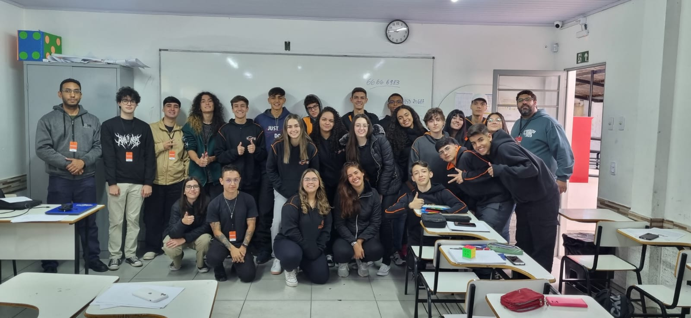

# Sprint 2

Nesta seção, deverão ser incluídos todos os artefatos produzidos pertinentes à entrega referente à Sprint 2.

O detalhamento do que deverá será entregue, será definido em sala em conjunto com seu(sua) professor(a).

Vale destacar que, tudo o que foi produzido de registros (fotográficos, lista de presença, vídeos etc) deverá ser incluído nesta etapa. Nesta etapa, também deverão ser apresentadas as percepções do grupo com relação à prática extensionista desenvolvida respondendo questões como: o objetivo inicial foi alcançado? quais foram as principais dificuldades enfrentadas pelo grupo? que mudanças poderiam ser realizadas que tornaria o processo mais eficiente? Entre outras...

# Registros Fotográficos

## Listas de chamada

### 2° anos

### 3° anos

### Foto

#### 2° ano

#### 3° ano

## Kahoot e Mentimeter

#### 2° anos

#### 3°anos

## Impressões do grupo

**Nicole:** Acredito que alcançamos o objetivo inicial. As palestras que fizemos foram bem proveitosas e os alunos estavam bem engajados. Creio que a maior dificuldade tenha sido entender o nosso público e achar uma maneira de conscientizá-los. Ao analizar as estatísticas do Kahoot, percemos que os 3° anos tiveram uma maior porcentagem de acerto do que os 2° anos. O terceiro ano também demonstrou maior inclinação política ao responder o mentimenter, citando nomes para descrever o que pensavam sobre a temática. 

**Enrico:** Tivemos sucesso na apresentação do projeto. Os segundos anos, embora estivessem em menor quantidade, não deixaram de participar ativamente, trazendo notável interesse no projeto; O Mentimeter obteve respostas simples, sem muita influência política, e o Kahoot teve mais erros, o que era esperado. Quanto aos terceiros anos, tivemos uma certa dificuldade em controlar as classes uma vez que a quantidade de alunos era alta, mas conseguimos executar as atividades com muita participação e interação dos alunos; Seu Mentimeter recebeu muitas respostas com visão política, o que esperávamos de alunos mais velhos, e o Kahoot teve resultados mais positivos, mostrando que estas turmas tinham maior discernimento de notícias falsas e verdadeiras. No geral, creio que todas as turmas mostraram absorção da intenção deseja com todo o desenvolvimento do projeto: a conscientização sobre as fake news.

**Rodrigo:** A apresentação foi bem tranquila. Todos integrantes do grupo apresentaram muito bem. Os alunos da escola foram bem receptivos e participativos em ambas as apresentações. Tive a impressão que com o pessoal do segundo ano a apresentação fluiu mais enquanto com o pessoal do terceiro ano, houve mais conversas, o que acabou prejudicando um pouco a comunicação. Apenas a parte prática do projeto teve que ser alterada pois a reprodução do som ficou inviabilizada, tinhámos alguns vídeos de exemplos mas não comprometeu a apresentação de maneira alguma. Com tudo, ficou claro para mim a importância de falar sobre a conscientização sobre fake news.
