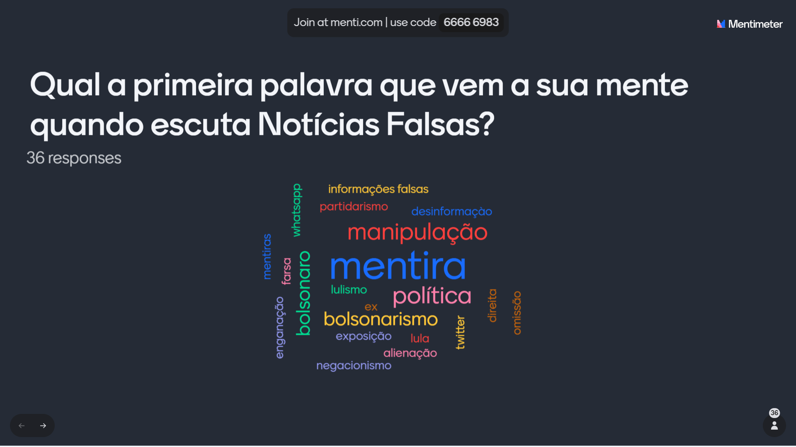

# Sprint 2

A ação foi realizada no Colégio CEPOC, localizado na R. Vivaldi Leite Ribeiro, 863 - Jardim Cascatinha, Poços de Caldas - MG, 37701-219. A palestra começou às 8:00h e foi até às 10:30h.

# Registros Fotográficos

## Listas de chamada

### 2° anos

### 3° anos

### Foto

#### 2° ano

#### 3° ano

## Kahoot e Mentimeter

#### 2° anos

#### 3°anos

## Impressões do grupo

**Nicole:** Acredito que alcançamos o objetivo inicial. As palestras que fizemos foram bem proveitosas e os alunos estavam bem engajados. Creio que a maior dificuldade tenha sido entender o nosso público e achar uma maneira de conscientizá-los. Ao analizar as estatísticas do Kahoot, percemos que os 3° anos tiveram uma maior porcentagem de acerto do que os 2° anos. O terceiro ano também demonstrou maior inclinação política ao responder o mentimenter, citando nomes para descrever o que pensavam sobre a temática. 

**Enrico:** Tivemos sucesso na apresentação do projeto. Os segundos anos, embora estivessem em menor quantidade, não deixaram de participar ativamente, trazendo notável interesse no projeto; O Mentimeter obteve respostas simples, sem muita influência política, e o Kahoot teve mais erros, o que era esperado. Quanto aos terceiros anos, tivemos uma certa dificuldade em controlar as classes uma vez que a quantidade de alunos era alta, mas conseguimos executar as atividades com muita participação e interação dos alunos; Seu Mentimeter recebeu muitas respostas com visão política, o que esperávamos de alunos mais velhos, e o Kahoot teve resultados mais positivos, mostrando que estas turmas tinham maior discernimento de notícias falsas e verdadeiras. No geral, creio que todas as turmas mostraram absorção da intenção deseja com todo o desenvolvimento do projeto: a conscientização sobre as fake news.

**Rodrigo:** A apresentação foi bem tranquila. Todos integrantes do grupo apresentaram muito bem. Os alunos da escola foram bem receptivos e participativos em ambas as apresentações. Tive a impressão que com o pessoal do segundo ano a apresentação fluiu mais enquanto com o pessoal do terceiro ano, houve mais conversas, o que acabou prejudicando um pouco a comunicação. Apenas a parte prática do projeto teve que ser alterada pois a reprodução do som ficou inviabilizada, tinhámos alguns vídeos de exemplos mas não comprometeu a apresentação de maneira alguma. Com tudo, ficou claro para mim a importância de falar sobre a conscientização sobre fake news.

**Rafael:** Objetivo cumprido, a turma foi bem receptiva aderiu bem as dinamicas feitas ao decorrer dos slides , foram participativos no kahoot , sendo assim a apresentação fluiu melhor e ficou mais leve e descontraída.
    Ao tocar no tema política houve um pouco de polêmica e debate da parte dos alunos , mas a situação foi rapidamente contornada pelo professor.
    A turma dos segundos anos estavam em menor numero , porem foram mais participativos que os terceiros que por sua vez interagiram mais nos tópicos e fizeram mais perguntas.
    Pra mim foi uma experiêcia nova e significativa interagir com o pessoal do ensino medio , porque podemos passar conhecimento e aprender bastante com eles tambem. 

**Joao Rubens:** Objetivo foi cumprido e mais fácil do que eu tinha imaginado. A turma dos segundos anos estavam em menor quantidade, porém foram as turmas em que os alunos mais participaram e fizeram perguntas. Os terceiros anos tinham mais alunos e foram um pouco difícil de conter, mas com a ajuda do professor foi possível também. Uma diferença notada entre as turmas foi que os do terceiro ano acertaram mais perguntas sobre a diferenciação de qual notícia era fake news ou não, e o Mentimeter teve mais respostas do cunho política. Acho que tivemos sucesso na apresentação, e com a apresentação do jogo do Bad News, conseguimos conscientizar todas essas turmas sobre o quão importante e perigoso discernir entre o que é verdadeiro e o que é falso. Um adendo foi que não conseguimos passar os vídeos que tinhamos deixado preparado pois deu problema no projetor, mas conseguimos continuar a apresentação com esse problema e tudo deu certo. 

**Bruno:** Vejo que a nossa apresentação foi um sucesso, inicialmente eu estava um pouco receoso e nervoso de falar em publico, mas no final deu tudo certo e as coisas foram muito mais tranquilas e melhores do que eu esperava. A maioria dos alunos interagiram de uma forma legal e tivemos o apoio dos professores também, os alunos gostaram bastante das dinamicas que fizemos com o jogos e o nosso intuito que era mostrar para eles que nem sempre é facil distinguir uma fake news de uma história real, foi alcançado e também mostrar o lado mais sério de casos de Fake News que levaram a morte de pessoas, e passar pra eles que existem casos aonde isso gera consequencias gravíssimas para determinadas pessoas. Acredito que a mensagem que queriamos passar com esse projeto foi absorvida tanto pelos alunos do 3º, quanto do 2º ano.

