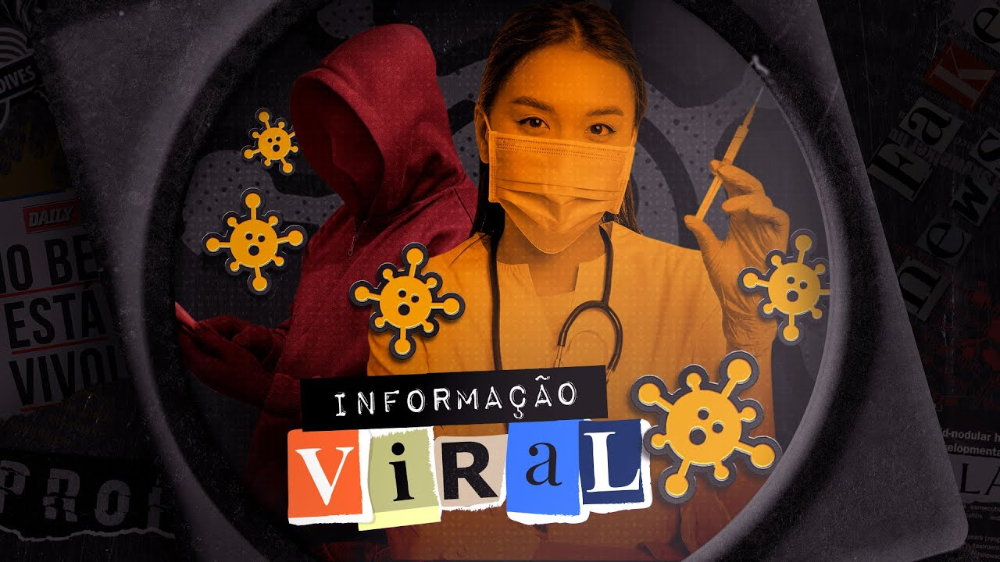

# 06 - Como saber se as fontes são mesmo confiáveis?

[Link para o vídeo](https://www.youtube.com/watch?v=I49bImxBRAE&list=PLyRcl7Q37-DWw10DNuAR1GaCfkPpO1ndY&index=5&ab_channel=Nerdologia)

## Como aprendemos durante essa série, a internet não é o principal causador de fake news mas sim um catalisador. No Nerdologia Fake News de hoje, vamos ver como as mídias alternativas, influenciadores e outras fontes podem propagar essas notícias falsas sem analisar com cuidado se as fontes são confiáveis ou seguras e como isso deve pode ser evitado. 

Entender as fontes de informação é essencial para evitar a desinformação. Embora o fenômeno não seja novo, a internet facilita a propagação de notícias falsas. É importante verificar a credibilidade das fontes e não compartilhar conteúdo sem antes validá-lo.

### Momentos-chave
Dificuldade em distinguir informações falsas não é um problema apenas para nossa geração, mas sempre foi importante verificar as fontes de informação para evitar enganos. Exemplos históricos mostram como notícias falsas existem há muito tempo, com influenciadores sendo usados para legitimar informações desde o século XIX.
- Exemplos históricos de notícias falsas remontam ao século XIX, como o caso do tabloide New York Sun em 1835, que usou um astrônomo famoso para validar uma história sobre criaturas na lua.
- Notícias falsas não são um fenômeno novo e veículos de comunicação, como o jornal NP no Brasil, já foram controversos por inventar notícias para aumentar vendas, como o caso do desaparecimento de Roberto Carlos em 1968.
- A disseminação de notícias falsas não é exclusiva da era da internet, mas a rede acelera o processo, tornando mais desafiador verificar a veracidade das informações, destacando a importância de fontes confiáveis.

Os meios de comunicação evoluíram de grandes jornais e emissoras de TV para incluir mídias alternativas como canais do YouTube e redes sociais, permitindo que indivíduos se tornem fontes de informação, impactando narrativas e diversidade. No entanto, a validação da informação tornou-se desafiadora com a proliferação de fontes e influenciadores digitais.
- A evolução dos meios de comunicação para incluir mídias alternativas e indivíduos como fontes de informação.
- O desafio da validação da informação com a multiplicidade de fontes e influenciadores digitais, destacando a disseminação de fake news durante a pandemia.

Pessoas mais jovens tendem a mudar suas opiniões e negar postagens anteriores sem sentir ataque à sua autoimagem, enquanto pessoas mais velhas têm mais dificuldade em negar, como se fosse um ataque à sua confiabilidade pessoal. É importante validar informações corretamente e não compartilhar notícias contraditórias.
- Cuidado com o viés cognitivo ao apelar para a autoridade, aceitar informações apenas por sua fonte conhecida pode levar a enganos e reforçar notícias falsas.
- Investir tempo em pesquisar e validar notícias é crucial, assim como questionar o método de como as coisas são feitas para obter informações confiáveis.
- Exigir credibilidade de influenciadores e mídia para apoiar iniciativas de checagem de fatos e ter consultores em diferentes áreas de conhecimento é fundamental para a produção de material informativo confiável.

A pressão popular tem um grande peso e consegue produzir resultados importantes, como a remoção de perfis falsos e disseminadores de notícias falsas em redes sociais. É crucial refletir sobre a influência da informação transmitida sem critérios ou referências.
- A importância da remoção de perfis falsos e disseminadores de notícias falsas em redes sociais, como o caso do Facebook em abril de 2022.
- Reflexão sobre a influência da informação transmitida sem critérios ou referências e a responsabilidade dos criadores de conteúdo em fornecer informações corretas.
- A necessidade de observar nosso próprio comportamento em relação à informação e demandar mudanças na forma como consumimos conteúdo.

#### Referências
How the Sun Conned the World With “The Great Moon Hoax”
https://daily.jstor.org/how-the-sun-conned-the-world-with-the-moon-hoax/
 
How shades of truth and age affect responses to COVID-19 (Mis)information: randomized survey experiment among WhatsApp users in UK and Brazil
https://www.nature.com/articles/s41599-021-00752-7
 
Desapareceu Roberto Carlos
https://www1.folha.uol.com.br/livrariadafolha/2011/04/904487-np-noticiou-o-desaparecimento-de-roberto-carlos-em-1968.shtml
