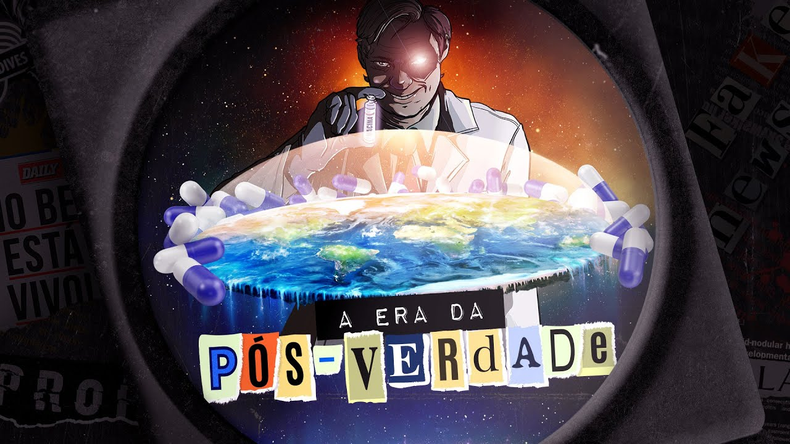

# 07 - O que é realidade na era da pós-verdade?

[Link para o vídeo](https://www.youtube.com/watch?v=usiYWIRFR7c&list=PLyRcl7Q37-DWw10DNuAR1GaCfkPpO1ndY&index=4&ab_channel=Nerdologia)

## Atualmente, nos vemos cercados de um excesso de informações que produzimos constantemente na Internet. Além disso, esses conteúdos e maneira que são entregues pelas plataformas acabam criando pequenas realidades para cada usuário, que permitem que cada um acredite em uma verdade e uma perspectiva. No Nerdologia de hoje, vamos entender esse fenômeno chamado de Era da Pós-Verdade e como podemos navegar de forma segura em meio a tudo isso.

O vídeo discute como a pressão popular pode influenciar a aceitação de evidências científicas, usando os casos da talidomida e da pílula do câncer como exemplos. Também aborda como as redes sociais e a "pós-verdade" afetam a percepção da ciência.

### Momentos-chave
A pressão popular pode levar a mudanças positivas, mas também a resultados negativos, como no caso da fosfoetanolamina e da talidomida, mostrando que a pressão popular pode competir com a evidência científica.
- O caso da talidomida e da fosfoetanolamina exemplifica como a pressão popular pode influenciar decisões políticas e regulatórias, mesmo diante de evidências científicas contrárias.
- A mobilização da população em torno de supostas soluções milagrosas, como a pílula do câncer, destaca a importância de equilibrar a pressão popular com a ciência e a regulamentação adequada.

A ciência é uma construção humana sujeita a questionamentos e mudanças, não sendo uma verdade absoluta. A relação entre ciência e sociedade é complexa e exige estudo e reflexão.
- A fragilidade da base da ciência e a expectativa dos cientistas em relação à aceitação da sociedade.
- A importância de estudar a ciência e seus construtores, questionando suas práticas e interesses.

As redes sociais têm sistemas que decidem o que priorizar em seu feed com base em metas definidas por outros, não por você. Isso impacta a sociedade e a percepção da realidade dos usuários.
- A influência das redes sociais na sociedade e na percepção da realidade dos usuários.
- O estudo de Amanda Jurno sobre as mudanças nos critérios do Facebook para organizar o feed dos usuários.
- A importância da ciência em questionar e corrigir seus próprios erros para alcançar um consenso e uma realidade mais precisa.
