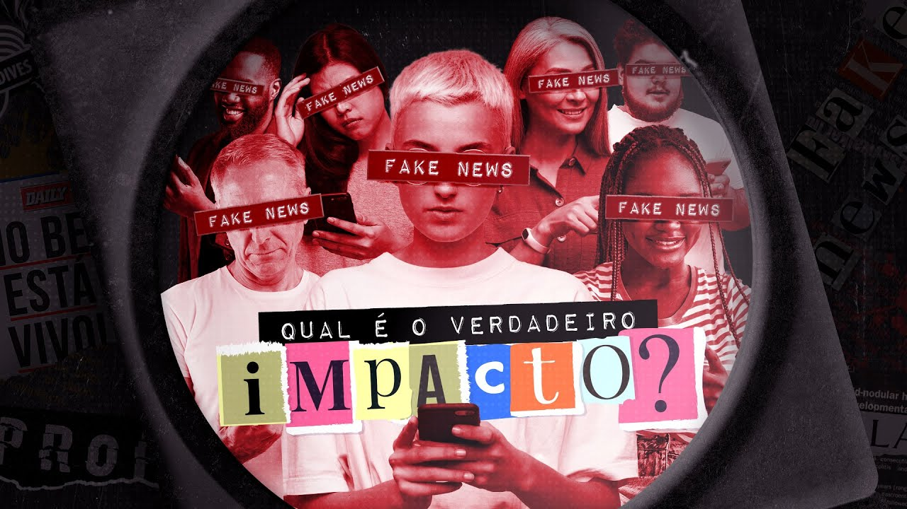

# 09 - É só um zap, que mal vai fazer?

[Link para o vídeo](https://www.youtube.com/watch?v=XVyqrOPEu84&list=PLyRcl7Q37-DWw10DNuAR1GaCfkPpO1ndY&index=2&ab_channel=Nerdologia)

## Qual é o verdadeiro impacto das Fake News? No episódio do Nerdologia Fake News de hoje, vamos entender como uma notícia falsa ou até uma evidência anedótica, quando compartilhada pode ter consequências a longo prazo. Veremos também como a mídia pode ser um instrumento para inspecionar e apontar o que há de errado na execução dos outros poderes. 

O impacto real das notícias falsas é acelerar a manipulação da opinião pública, a propaganda e o controle da mídia, a interferência do governo de um país na vida de outro e a violência desenfreada, tudo isso de forma mais fácil, rápida e perigosa.

### Momentos-chave
Neste vídeo, discutimos o verdadeiro impacto das fake news na sociedade, analisando como cientistas medem esse impacto e a importância de estudos cuidadosos para conclusões robustas.
- A importância da evidência científica e estudos cuidadosos na análise do impacto das fake news.
- Comparação entre diferentes países e ao longo do tempo para entender as causas e efeitos das fake news.

As tecnologias atuais facilitam a criação de falsas narrativas e manipulação, como visto em séries de TV e campanhas de filmes. O uso de contas falsas e ataques pessoais ilustra o poder das fake news e suas consequências.
- A série de TV e campanha de filme mostram como a manipulação pode ser feita com perfis falsos e ataques pessoais, ilustrando o impacto das fake news.
- O exemplo da campanha pelo 'Snyder Cut' revela como contas falsas e ameaças pessoais foram usadas para influenciar a indústria cinematográfica, destacando os perigos das fake news.
- O episódio do 'Snyder Cut' é um exemplo relativamente inofensivo do impacto das fake news, comparado à disseminação de desinformação política em mais de 80 países através das redes sociais.

A desinformação e as fake news têm impactos graves, como aumento da xenofobia e violência, além da queda na confiança nas notícias, afetando a sociedade globalmente.
- Impacto da desinformação em Costa Rica e no Reino Unido, levando a xenofobia e manipulação política.
- Queda na confiança nas notícias e aumento da desconfiança, especialmente em países politicamente divididos.
- Mudança no consumo de notícias, com redes sociais substituindo mídias tradicionais e desafios da desinformação.

#### Referências
Hepburn, Lisa; Hemenway, David.  Firearm availability and homicide: A review of the literature.  Aggression and Violent Behavior: A Review Journal.  2004; 9:417-40.
 
Hemenway, David; Miller, Matthew.  Firearm availability and homicide rates across 26 high income countries.  Journal of Trauma.  2000; 49:985-88.
 
Swedler DI, Simmons MM, Dominici F, Hemenway D.  Firearm prevalence and homicides of law enforcement officers in the United States.  American Journal of Public Health.  2015; 105:2042-48.
 
https://en.wikipedia.org/wiki/Indian_WhatsApp_lynchings
 
https://reutersinstitute.politics.ox.ac.uk/sites/default/files/2022-06/Digital_News-Report_2022.pdf
 
https://www.rollingstone.com/tv-movies/tv-movie-features/justice-league-the-snyder-cut-bots-fans-1384231/
 
https://www1.folha.uol.com.br/cotidiano/2018/09/veja-o-passo-a-passo-da-noticia-falsa-que-acabou-em-tragedia-em-guaruja.shtml
