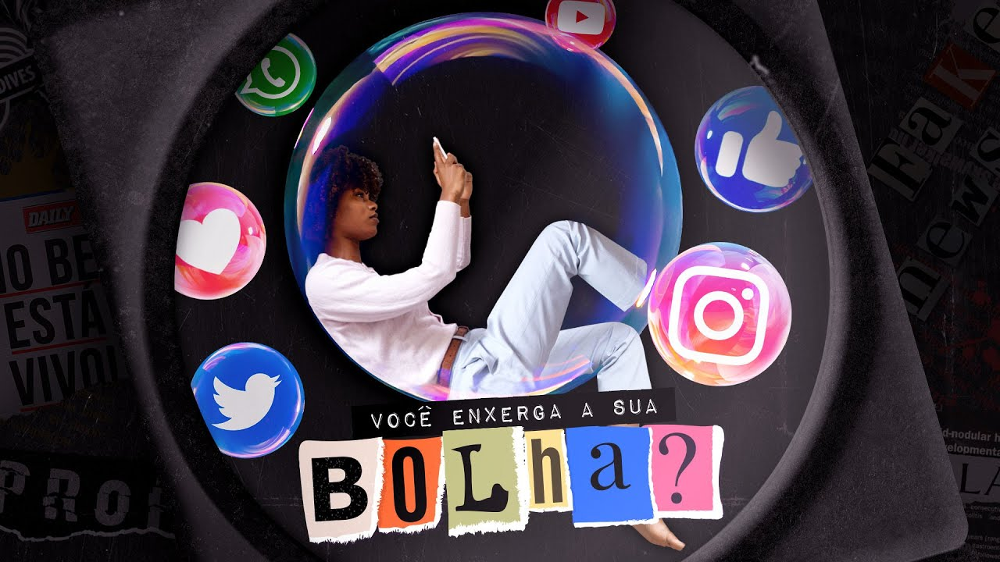

# 08 - Sua Bolha Social te afasta do diferente?

[Link para o vídeo](https://www.youtube.com/watch?v=-uZX3NMgjEE&list=PLyRcl7Q37-DWw10DNuAR1GaCfkPpO1ndY&index=3&ab_channel=Nerdologia)

## Como seres humanos, costumamos rotular o desconhecido por meio de julgamentos e estabelecer pré-conceitos baseados em traços e até estereótipos. Neste episódio do Nerdologia Fake News, vamos entender o que são as Bolhas Sociais e como eles influenciam o nosso pensamento. Também vamos ver como a internet vem intensificando esse fenômeno e como ele faz parte da Era da Pós Verdade.  

O vídeo discute como a "bolha social" nos afasta do diferente, levando-nos a fazer julgamentos rápidos com base em estereótipos e preconceitos. Isso é agravado pelas redes sociais, que reforçam nossos interesses e opiniões, limitando nosso acesso à diversidade.

### Momentos-chave
Atribuições e preconceitos baseados em primeiras impressões podem influenciar nossas interações sociais e decisões, revelando mais sobre nós mesmos do que sobre os outros. Nossas experiências moldam nossas percepções e tendemos a estereotipar para lidar com informações limitadas.
- A importância das primeiras impressões e atribuições na formação de relacionamentos e julgamentos interpessoais.
- O papel das experiências passadas na maneira como percebemos e categorizamos os outros, influenciando nossas interações sociais.
- Como a tendência ao preconceito pode surgir de atribuições baseadas em estereótipos e falta de informações precisas sobre indivíduos diferentes de nós.

Os estereótipos podem acelerar decisões em contextos incertos, mas também podem cristalizar diferenças sociais, criando bolhas sociais que nos alienam da complexidade do mundo e nos expõem a decisões simplificadas e preconceituosas.
- As bolhas sociais são zonas de conforto que simplificam o mundo, mas podem levar a problemas sistêmicos e preconceitos, afetando pessoas desconhecidas.
- As redes sociais, ao criar bolhas personalizadas, buscam reter nossa atenção e nos expõem a uma realidade simplificada, controlada por terceiros.
- Algoritmos de redes sociais influenciam nosso comportamento, transformando usuários em figuras influentes e nos tornando dependentes de interações validadoras.

A organização das pessoas em uma rede social é influenciada pelo conteúdo e pela pessoa que o compartilha, criando bolhas sociais que limitam a diversidade de conteúdo e opiniões. Romper essas bolhas é possível através da busca ativa por conteúdo diversificado e do papel das celebridades em trazer discussões críticas.
- As bolhas sociais não se limitam a pessoas semelhantes, mas também a temas homogêneos que são expostos a você, influenciando suas interações e visões de mundo.
- Silenciar palavras específicas ou selecionar conteúdo de interesse em redes sociais pode restringir a diversidade de ideias, levando a uma zona de conforto perigosa.
- Buscar ativamente por conteúdo diversificado e o papel das celebridades em trazer diferentes opiniões são formas de romper as bolhas sociais e promover debates críticos.

#### Referências
O que é realidade na era da pós-verdade? | Nerdologia
https://youtu.be/usiYWIRFR7c
 
Attribution Theories: How People Make Sense of Behavior
https://research.clps.brown.edu/SocCogSci/Publications/Pubs/Malle_(2011)_Chadee_chap_precorr.pdf
 
Rational Choice and the Structure of the Environment
https://uk.sagepub.com/sites/default/files/upm-binaries/25239_Chater~Vol_1~Ch_03.pdf
 
Measuring User Influence in Twitter: The Million Follower Fallacy
https://www.aaai.org/ocs/index.php/ICWSM/ICWSM10/paper/viewFile/1538/1826
 
Can Celebrities Burst Your Bubble?
https://arxiv.org/pdf/2003.06857.pdf
 
Endogenetic structure of filter bubble in social networks
https://royalsocietypublishing.org/doi/pdf/10.1098/rsos.190868
 
Smart Algorithm Bursts Social Networks' "Filter Bubbles"
https://spectrum.ieee.org/finally-a-means-for-bursting-social-media-bubbles
